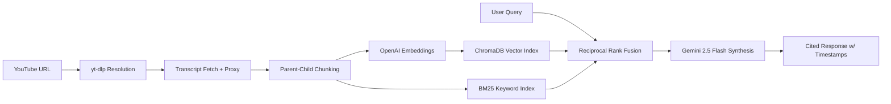

# YouTube Transcript RAG

A RAG pipeline for conversational video search that covers full playlists (not just a single video). 

Hybrid BM25 + vector retrieval with Reciprocal Rank Fusion, parent-child indexing, and timestamp-level citations. Built on FastAPI + LlamaIndex + ChromaDB with a React 19 / USWDS frontend meeting Section 508 accessibility standards. Deployed on AWS EC2.

**Live Demo:** [ytrag.justinduplain.com](https://ytrag.justinduplain.com)

## Architecture



1. **Ingestion:** User submits a YouTube video or playlist URL. `yt-dlp` resolves it to individual video IDs, and `youtube-transcript-api` fetches transcripts (routed through a rotating residential proxy on cloud deployments to avoid YouTube IP bans).
2. **Indexing:** Transcripts are split into parent nodes (1024 tokens) and child nodes (256 tokens). Child nodes are embedded and stored in ChromaDB for precise retrieval. Parent nodes are stored alongside them for context. Metadata is excluded from embeddings so only transcript text is semantically indexed.
3. **Retrieval:** User queries hit both a vector similarity search and a BM25 keyword search in parallel. Results are fused via Reciprocal Rank Fusion (RRF) and the top-ranked parent nodes are passed to the LLM.
4. **Synthesis:** Gemini 2.5 Flash generates a markdown-formatted answer with timestamp citations (e.g., `[04:23]`) linking directly to the source video at the cited second.

## Engineering Decisions & Trade-offs

### Hybrid BM25 + Vector Retrieval (RRF)
Pure vector search degrades on precise terminology and proper nouns. BM25 handles lexical precision; vector handles semantic similarity. RRF fuses both rankings without requiring score normalization, chosen over weighted averaging because it's robust to score distribution differences between retrievers.

### Parent-Child Indexing over Fixed Chunking
Fixed-size chunks force a trade-off: small chunks retrieve precisely but starve the LLM of context, large chunks give context but dilute retrieval signal. Parent-child indexing sidesteps this. Small child nodes (256 tokens) drive retrieval precision, and their corresponding parent nodes (1024 tokens) provide the LLM with enough surrounding context for coherent synthesis. I tuned these sizes iteratively against real transcript data.

### ChromaDB over Pinecone / pgvector
ChromaDB runs locally with zero infrastructure dependencies. For a single-server deployment, it eliminates network latency on vector lookups and keeps the entire pipeline self-contained. Pinecone would add a managed service cost and an external dependency for a workload that doesn't need distributed vector search. pgvector would work, but ChromaDB's native LlamaIndex integration made it the faster path to a working pipeline.

### Gemini for Generation + OpenAI for Embeddings
Gemini 2.5 Flash offers strong synthesis quality at low cost for generation. OpenAI's `text-embedding-3-small` remains a top performer for retrieval-quality embeddings at its price point. Using separate providers for generation and embeddings lets me optimize cost and quality independently rather than being locked into a single vendor's strengths and weaknesses.

### Metadata Exclusion from Embeddings
Video titles, channel names, and timestamps are stored as metadata but excluded from the embedding input. This prevents metadata tokens from polluting the semantic space. A query about "machine learning" shouldn't get a relevance boost just because a video title contains that phrase. The index searches transcript content only.

### Timestamp-Level Citations
Every claim in a generated answer links to the exact second in the source video. This isn't a nice-to-have; it's the core value proposition. If a user can't verify what the AI says, the system is just another chatbot. The citation architecture makes it a research tool.

### USWDS + Section 508 Accessibility
The frontend is built with @trussworks/react-uswds, Tailwind CSS, and a three-tier design token system (Base, Semantic, Component) via Style Dictionary v5. Section 508 accessibility is validated automatically with Vitest-Axe. This wasn't cosmetic. Building against federal design standards forced disciplined component architecture and real accessibility testing, not just aria-label spot checks.

## Tech Stack

### Frontend
- **Core:** React 19, Vite, TypeScript, React Router
- **Design:** USWDS (@trussworks/react-uswds), Tailwind CSS, Style Dictionary (v5)
- **Markdown:** react-markdown for formatted chat responses
- **Performance:** React Virtual for list virtualization
- **Testing:** Vitest, Vitest-Axe (a11y), Storybook

### Backend
- **Core:** FastAPI, Python 3.12+, Poetry
- **Orchestration:** LlamaIndex
- **Vector Store:** ChromaDB (local, persistent)
- **Models:** Google Gemini `gemini-2.5-flash` (LLM), OpenAI `text-embedding-3-small` (embeddings)
- **Extraction:** `yt-dlp`, `youtube-transcript-api`

### Deployment
- **Infrastructure:** AWS EC2 (Ubuntu)
- **Web Server:** nginx (reverse proxy to Uvicorn, serves static frontend build)
- **Process Management:** systemd
- **Deploy:** Shell script: local Vite build, rsync to EC2, Poetry install, systemd restart

## Deployment

The live demo runs on an EC2 instance with Ubuntu. nginx serves the pre-built React frontend as static files and reverse proxies API requests to the FastAPI backend running under Uvicorn via systemd.

Deployment is handled by a shell script (`deploy.sh`) that builds the frontend locally with Vite, rsyncs the project to EC2 (excluding source files, node_modules, .env, and secrets), installs backend dependencies via Poetry, and restarts the systemd service. Environment variables (API keys, proxy credentials) live in a `backend/.env` file on the server with `600` permissions and are never synced or committed.

The biggest production challenge was YouTube's aggressive IP blocking of cloud providers. Transcript fetches from EC2 fail immediately without intervention. The solution was integrating Webshare's rotating residential proxy pool into `youtube-transcript-api`. When proxy credentials are configured, all transcript requests route through residential IPs automatically. When they're absent, the backend falls back to direct requests for local development. See the [IP Bans](#working-around-ip-bans-cloud-deployments) section for setup details.

## Getting Started

### Prerequisites
- Node.js (v18+)
- Python 3.12+ with [Poetry](https://python-poetry.org/)
- OpenAI API Key (embeddings)
- Google API Key (LLM) -- get one at [Google AI Studio](https://aistudio.google.com/)
- **Webshare rotating residential proxy** -- required to fetch transcripts without being IP-blocked by YouTube. Purchase a "Residential" package (not "Proxy Server" or "Static Residential") at [Webshare](https://www.webshare.io/). See the [youtube-transcript-api docs](https://github.com/jdepoix/youtube-transcript-api#working-around-ip-bans) for background on why this is necessary.
  - *Additionally, `youtube-transcript-api` can be configured to be used without a proxy; see the above docs for details.*
- **Google Chrome** -- required for ingesting private or age-restricted videos (the backend uses your local browser cookies for authentication)

### 1. Setup Backend

```bash
cd backend

# Install dependencies
poetry install

# Copy the example env file and fill in your values
cp .env-example .env
```

Edit `backend/.env`:

```env
OPENAI_API_KEY=your_openai_api_key
GOOGLE_API_KEY=your_google_api_key

# Optional: use local browser cookies to access age-restricted or private content
YOUTUBE_SOURCE_BROWSER=chrome

# Optional but recommended for cloud deployments -- see Proxy section below
WEBSHARE_PROXY_USERNAME=
WEBSHARE_PROXY_PASSWORD=
```

Lock down file permissions so only your user can read the file:

```bash
chmod 600 backend/.env
```

Start the backend:

```bash
cd backend
poetry run uvicorn app.main:app --reload
```

The API will be available at `http://localhost:8000`.

### 2. Setup Frontend

```bash
cd frontend

# Install dependencies
npm install

# Run development server
npm run dev

# Run Storybook
npm run storybook
```

### 3. Usage

1. Open `http://localhost:5173`.
2. **Ingest:** Paste a YouTube video or playlist URL in the sidebar. Processing runs in the background, up to 5 videos per playlist, 10 videos total.
   - For private or unlisted playlists, use Chrome and ensure you're signed in to Google.
3. **Chat:** Ask questions about the ingested content. Responses are markdown-formatted with cited timestamps.
4. **Verify:** Click timestamps in citations to jump to the exact moment in the video.
5. **Clear:** Use "Clear All" in the sidebar to wipe the index and start fresh.

## Working Around IP Bans (Cloud Deployments)

YouTube blocks most cloud provider IPs (AWS, GCP, Azure, etc.). If you're running this on a server or seeing `RequestBlocked` / `IpBlocked` errors, you need a rotating residential proxy.

### Webshare Setup

1. Create an account at [Webshare](https://www.webshare.io/) and purchase a **Residential** proxy package (not "Proxy Server" or "Static Residential").
2. Go to [Proxy Settings](https://proxy2.webshare.io/proxy/settings) to retrieve your **Proxy Username** and **Proxy Password**.
3. Add them to `backend/.env`:

```env
WEBSHARE_PROXY_USERNAME=your_proxy_username
WEBSHARE_PROXY_PASSWORD=your_proxy_password
```

When both values are set, the backend will automatically route all transcript fetches through Webshare's rotating residential proxy pool. No other configuration is needed.

If the variables are absent or empty, the backend falls back to direct requests (fine for local development).

## Project Structure

```
.
├── deploy.sh               # Build, sync, and restart production
├── frontend/               # React application
│   └── src/
│       ├── tokens/         # 3-tier design tokens (Base, Semantic, Component)
│       ├── components/     # USWDS-compliant UI components + Storybook stories
│       └── pages/          # Main views (Ingestion, Chat)
└── backend/                # FastAPI application
    ├── .env-example        # Environment variable template
    └── app/
        ├── api/v1/         # REST endpoints (ingest, chat, status, clear)
        └── services/       # Core logic
            ├── yt_dlp_service.py       # Video/playlist/channel URL resolution
            ├── transcript_service.py   # Transcript fetching + proxy config
            ├── indexing_service.py     # ChromaDB ingestion + parent-child chunking
            └── retrieval_service.py    # Hybrid BM25 + vector search with RRF
```

## API Endpoints

| Method | Path | Description |
|---|---|---|
| `POST` | `/api/v1/ingest` | Start background ingestion of a YouTube URL |
| `GET` | `/api/v1/ingest/status/{job_id}` | Poll ingestion job progress |
| `POST` | `/api/v1/chat` | Query indexed transcripts with conversation history |
| `GET` | `/api/v1/sources` | List all indexed video sources |
| `DELETE` | `/api/v1/sources` | Clear all indexed data |
| `GET` | `/health` | Health check |

## Testing

```bash
# Backend
cd backend && poetry run pytest

# Frontend + accessibility
cd frontend && npm test
```

## AI Usage Disclosure
Developed with AI-assisted tooling; all architecture, code review, and engineering decisions are my own.
